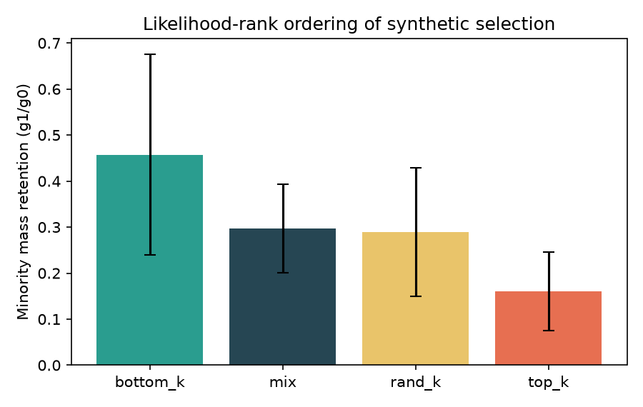
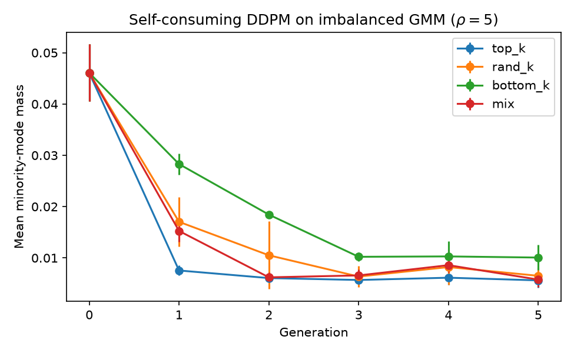

# Likelihood-Ranked Synthetic Selection in Self-Consuming Diffusion: Minority Extinction Ordering on Imbalanced Mixtures

**Author:** Muhammad Alamzeb (sole / first author)  
**Contact:** shayankhanmahar@gmail.com  
**Venue target:** arXiv cs.LG / workshop empirical note (named author is correct for arXiv; anonymize only for double-blind venues)  
**Status:** Revision addressing statistical/methods review (`paper/SUBMIT.md`)

## Abstract

Self-consuming training loops—retraining generative models on their own outputs—can induce *model collapse*, including loss of rare modes. We study unlabeled selection of synthetic samples by a denoising likelihood proxy in self-consuming DDPM training on imbalanced mixtures. Define the minority-mass ratio \(r=m^{(1)}/m^{(0)}\). Under matched budgets, on a primary matrix of **eight** seed–imbalance cells, bottom-\(k\) > random-\(k\) > top-\(k\) holds on mean \(r\) (\(0.57/0.36/0.17\)), but a per-\(\rho\) split shows the full order is driven by \(\rho{=}5\) (\(5/5\) seeds) and does *not* hold seed-wise at \(\rho{=}10\) (\(0/3\)). Paired contrasts vs random-\(k\) (\(n{=}8\)) show large effects (Cohen’s \(d_z{\approx}1.0\); Wilcoxon \(p{\approx}0.042\); Holm-adjusted \(p{\approx}0.085\)). A hypothesized “false stability” pattern—top-\(k\) improving sliced \(W_2\) while minorities die—is **not observed** at generation 1 (\(\Delta W_2>0\) on \(8/8\) cells; Wilcoxon \(p{\approx}0.014\)). Directional transfer checks on 8D GMM and Digits-PCA (3 seeds) match the order. Code: https://github.com/muhammadalamzeb/likelihood-rank-self-consuming-diffusion.

## 1 Introduction

As synthetic data proliferates, generative models are increasingly trained on mixtures of real and model-generated samples. Iterated self-consumption can cause *model collapse*: progressive loss of diversity and forgetting of rare modes [Shumailov et al., 2023; Alemohammad et al., 2023; Gerstgrasser et al., 2024]. Mitigations include accumulating real data [Gerstgrasser et al., 2024], injecting fresh real samples, and *filtering* synthetic data [Feng et al., 2024; Cai et al., 2025].

When the only available score is the generator’s own likelihood (or denoising loss), how should one select synthetics? Feng et al. [2024] show that *task verifiers* for labeled synthetic answers can prevent collapse. Cai et al. [2025] filter “unrealistic” diffusion samples via latent probes and report aggregate FID/precision/recall. Alemohammad et al. [2023] observe that sampling bias toward high-quality generations drives a quality–diversity tradeoff. What is missing is a **matched-budget, mode-exact** causal contrast among likelihood ranks.

**What is new.** Prior work describes quality–diversity tradeoffs and filtering heuristics. We isolate an *interventional* selection policy \(\pi\) (top-\(k\) vs random-\(k\) vs bottom-\(k\)) at matched synthetic count and matched real-mix \(\alpha\), and measure mode masses against known centers. The contribution is this controlled contrast and the resulting empirical minority-retention order—not a new named training algorithm or ImageNet-scale SOTA method.

**Contributions.**

1. A controlled self-consuming DDPM protocol on imbalanced GMMs with exact mode masses.
2. Evidence for a likelihood-rank ordering of minority retention under matched \(k\) and \(\alpha\).
3. Evidence that top-\(k\) does *not* improve sliced \(W_2\) vs random-\(k\) while minorities decline.
4. Directional transfer checks: 8D GMM and Digits-PCA with nearest class-mean occupancy.

## 2 Related work

**Model collapse.** Shumailov et al. [2023] document recursive training collapse and tail forgetting. Gerstgrasser et al. [2024] show accumulating real+synthetic data can avoid collapse. Alemohammad et al. [2023] (*MAD*) highlight quality-biased sampling.

**Verification and filtering.** Feng et al. [2024] argue verification of synthesized *labels* prevents collapse. Cai et al. [2025] (*LSF*) filter synthetic images using latent-space realism scores. Neither isolates unlabeled ELBO top-\(k\) vs random-\(k\) with mode-grounded metrics on continuous mixtures.

**Temperature / diversity knobs.** Inference-time temperature methods [Xu et al., 2025; Li et al., 2026] reshape sampling diversity; we instead intervene on *training-set selection* inside self-consuming loops.

## 3 Method

### 3.1 Self-consuming loop

Let \(f^{(g)}\) be a DDPM trained on \(\mathcal{D}^{(g)}\). Sample synthetic set \(\widehat{\mathcal{D}}^{(g+1)}\). Build the next train set by mixing a fixed real buffer \(\mathcal{D}_{\mathrm{real}}\) (fraction \(\alpha\)) with selected synthetics.

### 3.2 Likelihood proxy and policies

Score \(s(x)\) is mean denoising MSE over a \(t\)-grid (ELBO proxy; **lower** = higher likelihood). At matched synthetic count \(n_{\mathrm{syn}}\) and real fraction \(\alpha\):

- **top-\(k\) / bottom-\(k\) / random-\(k\):** select a pool of size \(k=\max(n_{\mathrm{syn}},\lfloor k_{\mathrm{frac}}N\rfloor)\) by lowest / highest / uniform scores, then draw \(n_{\mathrm{syn}}\) from that pool and mix with \(\alpha\) real.
- **mix:** same \(\alpha\) real mix, but the synthetic portion is a uniform subsample of *all* \(N\) synthetics (no rank filter; no \(k\)-pool stage).
- **replace:** training set is pure synthetic (collapse reference).

Thus **mix ≠ random-\(k\)**: random-\(k\) still uses a size-\(k\) subsample stage matched to top/bottom; mix skips ranking entirely.

### 3.3 Metrics

Nearest-mean mode assignment on known centers (GMM means, or Digits empirical class means in PCA space). Report minority-mean mass \(m\) (modes \(1{\ldots}K-1\)), majority mass (mode \(0\)), and the ratio

\[
r \;=\; \frac{m^{(1)}}{m^{(0)}},
\]

which we call *retention* even when \(r>1\) (minority mass can rise after one generation under bottom/random selection).

**Sliced \(W_2\):** average of squared 1D Wasserstein distances over **24** random projections; each comparison uses up to **400** synthetic and **400** held-out real points (same seed schedule as the run). Implementation: `wasserstein2_1d_proj(..., n_proj=24)` in `run_w2_false_stability.py`.

## 4 Experiments

### 4.1 Primary design (defines \(n{=}8\))

\(K{=}4\) modes, tiny MLP denoiser, \(G{=}5\), \(\alpha{=}0.5\), \(k_{\mathrm{frac}}{=}0.5\). Logs: `w2_fs.jsonl` (\(n{=}228\) records).

| \(\rho\setminus\) seed | 0 | 1 | 2 | 3 | 4 |
|------------------------|---|---|---|---|---|
| 5 | ✓ | ✓ | ✓ | ✓ | ✓ |
| 10 | ✓ | ✓ | ✓ | — | — |

Seeds 3–4 were run **only** at \(\rho{=}5\) (replication). \(\rho{=}10\) uses seeds \(\{0,1,2\}\) only. That yields **exactly eight** seed–imbalance cells for primary averages (`table_seed_rho_grid.csv`).

### 4.2 Primary retention results

Mean \(r=m^{(1)}/m^{(0)}\) pooled over the eight cells:

| Policy | Mean \(r\) | Std | \(n\) |
|--------|------------|-----|-------|
| bottom_k | 0.572 | 0.289 | 8 |
| rand_k | 0.360 | 0.173 | 8 |
| mix | 0.328 | 0.100 | 8 |
| top_k | 0.172 | 0.078 | 8 |

**Per-\(\rho\) breakdown** (generation 1; `table_retention_by_rho.csv`):

| \(\rho\) | \(n\) | bottom | rand | top | Full order | top<rand / bot>rand |
|----------|-------|--------|------|-----|------------|---------------------|
| 5 | 5 | 0.737 | 0.456 | 0.183 | **5/5** | 5/5 / 5/5 |
| 10 | 3 | 0.296 | 0.199 | 0.154 | **0/3** | 2/3 / 1/3 |

Pooled “7/8 top worse; 6/8 bottom better” counts are largely driven by \(\rho{=}5\). We **do not** claim robust seed-wise ordering at \(\rho{=}10\) (minorities near floor at \(g{=}0\)).

**Paired contrasts vs random-\(k\)** (pooled \(n{=}8\); `table_stats_retention.csv`):

| Contrast | Mean \(\Delta\) | Bootstrap 95% CI | Cohen \(d_z\) | Wilcoxon \(p\) | Holm \(p\) |
|----------|-----------------|------------------|---------------|----------------|------------|
| top − rand | −0.188 | [−0.30, −0.06] | −1.04 | 0.042 | 0.085 |
| bottom − rand | +0.212 | [0.08, 0.35] | +1.00 | 0.042 | 0.085 |





### 4.3 Sliced \(W_2\) (“false stability” check)

| Gen \(g\) | Mean \(\Delta W_2\) (top−rand) | Std | \(\#\{>0\}\) | Wilcoxon \(p\) |
|-----------|--------------------------------|-----|--------------|----------------|
| 1 | +0.113 | 0.099 | 8/8 | 0.014 |
| 2 | +0.061 | 0.060 | 6/8 | 0.042 |
| 3 | +0.039 | 0.035 | 7/8 | 0.030 |
| 4 | +0.027 | 0.032 | 7/8 | 0.030 |
| 5 | +0.024 | 0.033 | 7/8 | 0.030 |

**Evidence against** a top-\(k\) \(W_2\) improvement under minority loss—not a formal Neyman–Pearson falsification.

### 4.4 Real-mix \(\alpha\) ablation (illustrative; \(n{=}2\) seeds)

Exploratory only—order-hold counts with two seeds are preliminary.

| \(\alpha\) | bottom | rand | top | Order holds |
|------------|--------|------|-----|-------------|
| 0.25 | 0.25 | 0.17 | 0.05 | 1/2 |
| 0.50 | 0.62 | 0.49 | 0.24 | 2/2 |
| 0.75 | 1.34 | 0.77 | 0.94 | 0/2 |

At the *mean* level, top is worst for \(\alpha\in\{0.25,0.50\}\), but at \(\alpha{=}0.25\) the seed-wise full order holds only 1/2. At \(\alpha{=}0.75\), top vs random reverses on average (0/2 order holds). Treat as an illustrative hint, not a hard scope law.

### 4.5 Transfer checks (directional; \(n{=}3\))

These are **not** powered significance tests; we report mean±std and seed-wise order counts.

- **8D GMM** (`w2_fs_hd`): retention \(0.55{\pm}0.20\) / \(0.27{\pm}0.06\) / \(0.08{\pm}0.03\) (bottom/rand/top); order holds **3/3**.
- **Digits-PCA** (`w2_fs_digits_pca`): \(1.49{\pm}0.11\) / \(1.11{\pm}0.08\) / \(0.68{\pm}0.17\); order holds **3/3**. Ratios \(>1\) mean minority mass *increased* from \(g{=}0\) to \(g{=}1\) under bottom/random (definition of \(r\)).

An earlier Digits CVAE + classifier probe is inconclusive and unused for claims.

### 4.6 Selection-pool size (\(k_{\mathrm{frac}}\))

Under \(k=\max(n_{\mathrm{syn}},\lfloor k_{\mathrm{frac}}N\rfloor)\), \(k_{\mathrm{frac}}\in\{0.25,0.5\}\) are operationally equivalent when \(n_{\mathrm{syn}}\) binds; at \(0.75\) top-\(k\) remains worst (`table_kfrac_retention.csv`).

## 5 Analysis

Likelihood top-\(k\) preferentially retains points the model already explains well (majority modes), reducing minority inflow. Bottom-\(k\) does the opposite relative to random. Aggregate sliced \(W_2\) is a poor monitor for minority survival: it moves with top-\(k\) in the wrong direction for a “quality win.”

## 6 Limitations

- Toy 2D/8D GMMs and Digits-PCA; not ImageNet-scale.
- Primary Wilcoxon \(n{=}8\); Holm-adjusted \(p{\approx}0.085\). Seed-wise full order is robust at \(\rho{=}5\) only (\(0/3\) at \(\rho{=}10\)).
- \(\alpha\) ablation uses only two seeds (illustrative).
- Transfer checks: three seeds, no formal tests.
- For **double-blind** venues, the public GitHub URL reveals author identity; use an anonymous mirror for review (arXiv may keep the named repo).
- Contribution is a controlled empirical contrast relative to MAD/LSF/Feng, not a SOTA training method.

## 7 Conclusion

Under matched budgets, unlabeled likelihood ranking induces a minority-retention order that is **stable at moderate imbalance** (\(\rho{=}5\)) and **not seed-wise reliable at** \(\rho{=}10\) in our matrix. Top-\(k\) does not improve sliced \(W_2\) vs random-\(k\) on the primary eight cells. Preferring “most likely” synthetics is not a free lunch for minority survival when rare modes are still measurable.

## References

- Alemohammad, S., Casco-Rodriguez, J., Luzi, L., Humayun, A. I., Babaei, H., LeJeune, D., Siahkoohi, A., and Baraniuk, R. G. (2023). Self-Consuming Generative Models Go MAD. arXiv:2307.01850.
- Cai, Z., Wang, Y., Liu, Y., and Zhang, X. (2025). Stabilizing Self-Consuming Diffusion Models with Latent Space Filtering. arXiv:2511.12742.
- Feng, Y., Dohmatob, E., Yang, P., Charton, F., and Kempe, J. (2024). Beyond Model Collapse: Scaling Up with Synthesized Data Requires Verification. arXiv:2406.07515.
- Gerstgrasser, M., Schaeffer, R., Dey, A., Rafailov, R., Pai, D., Sleight, H., Hughes, J., Korbak, T., Agrawal, R., Gromov, A., Roberts, D. A., Yang, D., Donoho, D., and Koyejo, S. (2024). Is Model Collapse Inevitable? arXiv:2404.01413.
- Li, P., Aksan, E., Ichim, A.-E., Beeler, T., and Sorkine-Hornung, O. (2026). Diversify Diffusion with Temperature Sampling and Variance-Corrective Time Shifting. arXiv:2607.10853.
- Shumailov, I., Shumaylov, Z., Zhao, Y., Gal, Y., Papernot, N., and Anderson, R. (2023). The Curse of Recursion: Training on Generated Data Makes Models Forget. arXiv:2305.17493.
- Xu, Y., Wu, Y., Park, S., Zhou, Z., and Tulsiani, S. (2025). Temporal Score Rescaling for Temperature Sampling in Diffusion and Flow Models. arXiv:2510.01184.

## Appendix A Reproducibility

```bash
# Linux / macOS / any Python
python scripts/reproduce_w2.py
# or
bash scripts/reproduce_w2.sh

# Windows PowerShell
powershell -File scripts/reproduce_w2.ps1
```

All numerical tables are produced from logged JSONL via analysis scripts (no hand-edited metrics). Source, configs, seeds, and logs: https://github.com/muhammadalamzeb/likelihood-rank-self-consuming-diffusion

## Appendix B Experiment provenance

- Experiment IDs: `w2_fs`, `w2_fs_hd`, `w2_fs_digits_pca` (supported); `w2_fs_digits` (CVAE; inconclusive).
- Frozen historical stacks v0–v8 were **not** reused as novelty claims.
- Constraint Set v4; discovery record: `docs/PATH2_DISCOVERY.md`; survivor: `docs/RESEARCH_SURVIVOR.md`.
